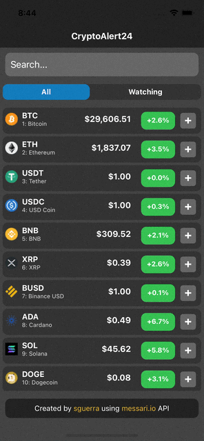

# CryptoAlert24

An app to keep track of changes in the price of your favourite crypto coins in the last 24hrs

<center>
    
</center>

## Features

- Search for crypto coin information from an extensive catalog available online
- Take a look of the profile information of all available coins
- Watch your favourite assets for keeping track of them easily
- Get alerts on changes of the price of your watched assets in the last 24hr (Custom percent threshold)

## Screenshots

### Search for assets

<center>
    
</center>

### Check an asset details

<center>
    
</center>

### Add asset to watchlist / Remove asset from watchlist

<center>
    
</center>

### Get alerts on price percent variation

<center>
    
</center>

## Technologies

- [React Native](https://reactnative.dev/)
- [TypeScript](https://www.typescriptlang.org/)
- [Messari's Crypto Data API](https://messari.io/api)
- [Redux](https://es.redux.js.org/)

## Requirements

- [React Native (Development Setup - ios)](https://reactnative.dev/docs/environment-setup)

## Installation

```bash
git clone git@github.com:sguerra/CryptoAlert24.git
cd CryptoAlert24
npm install
```

### ios

```bash
    cd ios
    pod install
```

## How to run? (ios)

### Config

Rename `.env.sample` to `.env` and set the next values:

```
# APP_MODE: 'prod'|'dev' - Application Mode
APP_MODE='prod'
APP_PRICE_THRESHOLD=5
# API env vars
API_BASE_URI='https://data.messari.io/api'
API_IMG_URI='https://messari.io/asset-images'
API_KEY='f126939c-9ffd-4741-b6de-ca414f2e3b57'
# API refresh rate (in seconds)
API_REFRESH_RATE=30
```

### Run

```bash
npx react-native start
npx react-native run-ios
```

## Future work

- Get information from own server
  - Caching information
  - Websocket price refresh
- Native background actions
  - Background Fetch
  - Notifications when app is closed
- Publish on store
